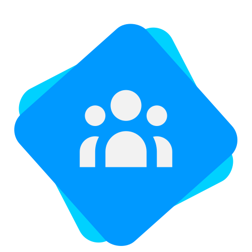

<p align="center" style="display: flex; align-items: center; justify-content: center; flex-direction: column">
  
  <h1 align="center">KeyboardServices</h1>
</p>

<p align="center">
  This repository is currently in development.
</p>

## Installation

```bash
$ npm install
$ npm i -g @nestjs/cli
```

## Running the app
### via docker
```bash
$ docker-compose up
```

### via system
```bash
$ nest start --watch <microservice>

```
*this requiries to have **@nestjs/cli** installed*

### Test

```bash
# unit tests
$ npm run test

# e2e tests
$ npm run test:e2e

# test coverage
$ npm run test:cov
```

## Support the framework

Nest is an MIT-licensed open source project. It can grow thanks to the sponsors and support by the amazing backers. If you'd like to join them, please [read more here](https://docs.nestjs.com/support).

## License

Nest is [MIT licensed](LICENSE).
